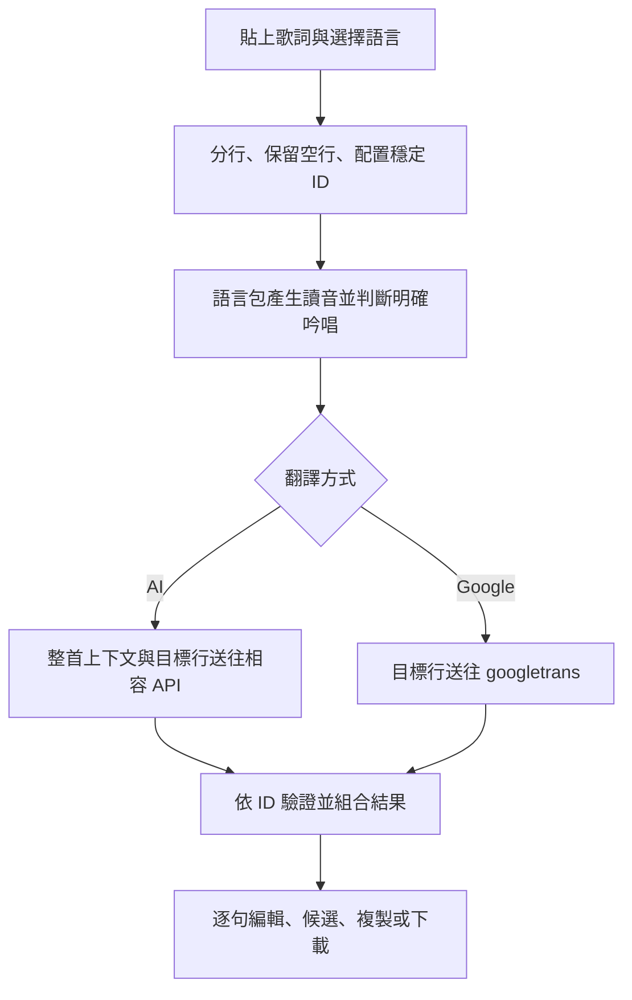

# Lingua Workbench

Lingua Workbench 是一個在本機執行的日文／韓文歌詞翻譯與編修工作台，目標輸出為台灣繁體中文。它將原文、羅馬字讀音與中文譯文逐行對齊，讓使用者先取得整首翻譯，再逐句比較 AI 與 Google 候選、手動校稿並匯出結果。這是一個適合個人使用與繼續開發的開源工具，不宣稱能取代人工翻譯，也尚未以公開網路服務或正式產品環境為目標。

## 功能

- 日文與韓文來源語言，可依安裝需求只啟用其中一種。
- OpenAI-compatible Chat Completions：參考整首歌的上下文翻譯，並以行號驗證回傳結果。
- Googletrans：快速產生整首直譯或單句參考版本。
- 原文、讀音與台灣繁中譯文逐行對齊，保留原歌詞中的空行。
- 保守辨識純吟唱並保留原文，也可在任何一行手動選擇「保留原文」。
- 逐句 AI 重新翻譯，可選自然、口語、直譯或文藝風格，並加入補充要求。
- 譯文可直接編輯；候選版本確認後才會套用。
- 草稿自動存在目前瀏覽器的 `localStorage`。
- 複製完整結果，或下載包含原文、讀音與目前譯文的 TXT。

## 支援語言與讀音

| 來源語言 | 代碼 | 讀音欄 | Google 來源代碼 | 主要套件 |
| --- | --- | --- | --- | --- |
| 日文（日本語） | `ja` | Hepburn 羅馬字 | `ja` | `pykakasi` |
| 韓文（한국어） | `ko` | 韓文羅馬字（修訂式，啟用常見發音規則） | `ko` | `koroman` |

讀音是程式自動產生的輔助資訊。人名、特殊讀法、歌詞刻意變音，以及日文數字或量詞的實際唱法仍可能需要人工確認。

## 使用流程

1. 選擇日文或韓文，貼上歌詞並保留想要的分段空行。
2. 選擇「語境翻譯」或「快速直譯」。
3. 送出後逐行查看原文、羅馬字讀音與台灣繁中譯文。
4. 直接修改中文，或取得 AI／Google 單句候選後再決定是否套用。
5. 對不需要翻譯的句子按「保留原文」，必要時可按「還原」回到首次產生的版本。
6. 複製目前結果，或下載 TXT。匯出內容會採用畫面上最後編輯的文字。

## 本機快速開始

需要 Python 3.11 以上版本。若要使用 AI 翻譯，還需要一組 OpenAI-compatible 服務的 API key；只使用 Google 翻譯時可以不設定 key。

### macOS / Linux

```bash
git clone https://github.com/Lilian0414/lingua-workbench.git
cd lingua-workbench
python3 -m venv .venv
source .venv/bin/activate
python -m pip install --upgrade pip
pip install -r requirements.txt
cp .env.example .env
python -m flask --app app run
```

### Windows PowerShell

```powershell
git clone https://github.com/Lilian0414/lingua-workbench.git
Set-Location lingua-workbench
py -3.11 -m venv .venv
.\.venv\Scripts\Activate.ps1
python -m pip install --upgrade pip
pip install -r requirements.txt
Copy-Item .env.example .env
python -m flask --app app run
```

啟動後開啟 <http://127.0.0.1:5000>。停止服務可在終端機按 `Ctrl+C`。

`requirements.txt` 預設安裝日韓兩種語言的執行依賴。若只需要單一語言，可改用：

```bash
# 日文版
pip install -r requirements-ja.txt

# 韓文版
pip install -r requirements-ko.txt
```

並在 `.env` 將 `ENABLED_LANGUAGES` 設成相對應的 `ja` 或 `ko`。開發與執行測試請安裝 `requirements-dev.txt`；它會額外安裝 pytest，並包含日韓兩種語言的依賴。

## 設定

應用程式啟動時會讀取專案根目錄的 `.env`。此檔已列入 `.gitignore`，請勿提交真正的 API key。

| 環境變數 | 預設值 | 說明 |
| --- | --- | --- |
| `LLM_API_KEY` | 無 | OpenAI-compatible 服務的 API key。AI 整首翻譯與逐句重翻需要設定。若未設定，會再讀取舊名稱 `GROQ_API_KEY`。 |
| `LLM_BASE_URL` | `https://api.groq.com/openai/v1` | API 根網址；程式會呼叫其 `/chat/completions`。結尾 `/` 會自動移除。 |
| `LLM_MODEL` | `openai/gpt-oss-20b` | 傳給服務的模型名稱。若未設定，會再讀取舊名稱 `GROQ_MODEL`。 |
| `LLM_DISPLAY_NAME` | `AI 模型` | 顯示在介面與候選版本上的服務名稱。 |
| `LLM_RESPONSE_FORMAT` | `json_schema` | 可設為 `json_schema`、`json_object` 或 `prompt_only`；其他值會回到 `json_schema`。 |
| `ENABLED_LANGUAGES` | `ja,ko` | 以逗號分隔的來源語言代碼。未知代碼會被忽略；若沒有任何有效代碼，會回到日韓皆啟用。 |
| `DEFAULT_SOURCE_LANGUAGE` | 第一個啟用的語言 | 預設來源語言。若不在啟用清單中，會改用清單中的第一個。 |
| `FLASK_DEBUG` | 未啟用 | 直接執行 `python app.py` 時，設為 `1` 可開啟 Flask debug 模式。一般使用不建議開啟。 |

最小 AI 設定範例：

```env
LLM_API_KEY=your_provider_api_key
LLM_BASE_URL=https://api.groq.com/openai/v1
LLM_MODEL=openai/gpt-oss-20b
LLM_DISPLAY_NAME=AI 翻譯
LLM_RESPONSE_FORMAT=json_schema
ENABLED_LANGUAGES=ja,ko
DEFAULT_SOURCE_LANGUAGE=ja
```

任何實作 OpenAI-compatible `POST /chat/completions` 的服務原則上都可使用，但模型名稱、端點與結構化輸出支援度必須符合該服務的規格：

- `json_schema`：傳送嚴格 JSON Schema，要求模型只回傳指定行號。適合完整支援 Structured Outputs 的服務。
- `json_object`：只要求 JSON object，適合支援 JSON mode、但不接受 JSON Schema 的服務。
- `prompt_only`：不傳送 `response_format`，只透過提示要求 JSON。適合不支援前兩種格式的相容端點。

不論選哪一種模式，程式都會再次解析 JSON，並檢查回傳 key 是否與要求翻譯的行號完全相同。這能防止行數悄悄錯位，但不能保證譯文內容本身正確。

> `.env` 不會覆蓋終端機中已存在的同名環境變數。修改 `.env` 後需停止並重新啟動 Flask，設定才會重新載入。

## 翻譯與對齊方式

貼上的內容會先正規化換行。每個非空白行取得穩定的數字 ID，空白行則只保留為版面分段；非空白行開頭與結尾的空白會被移除。

使用 AI 整首翻譯時，完整非空白歌詞會放進 `source_lines` 作為上下文，但只要求模型翻譯 `target_ids` 指定的行。回傳結果必須包含每個指定 ID，且不能多行或少行。逐句重新翻譯也會帶入整首原文、目前畫面上的其他譯文、指定行號與使用者的風格要求，以維持人稱、情緒和用詞的一致性。

Google 模式會將需要翻譯的行批次送往 Googletrans。結果仍按照原本的行 ID 組回，因此原文、讀音和中文譯文不會因空白行或吟唱而位移。



## 吟唱保留

Lingua Workbench 採取保守規則：只有整行都能明確判定為重複吟唱音節時，才在本機直接保留，不送去翻譯。目前可涵蓋例如：

- `ラララ`、`ラ ラ ラ`
- `啦啦啦`、`나 나 나`
- `la la la`、`oh-oh-oh`
- 少量為舊版相容保留的固定日文唱詞

包含一般詞句或語義不明確的內容不會因為開頭像 `la`、`na` 就自動保留，例如 `language`、`natural`、`la vie en rose`、`Oh 君が好き`。這套規則刻意不做完整的語言學分類，因此可能漏掉其他無語意唱詞；反過來，也不應把所有擬聲詞都視為無語意。

若自動結果不符合歌曲語境，可使用每一行的「保留原文」，將目前中文欄直接改成原句。這個操作只修改草稿，不會更動來源歌詞或吟唱規則。

## 架構

```text
app.py       Flask 頁面、整首翻譯與逐句 API
core/        分行、資料模型、結果組裝與共用錯誤
languages/   日文／韓文讀音、翻譯提示與吟唱規則
providers/   OpenAI-compatible LLM 與 Googletrans 介面
templates/   Jinja HTML 頁面
static/      原生 JavaScript 互動、localStorage 草稿與樣式
tests/       核心、語言包、provider 與 Flask route 測試
```

主要 HTTP 路徑：

| 路徑 | 方法 | 用途 |
| --- | --- | --- |
| `/` | `GET` | 顯示工作台。 |
| `/` | `POST` | 驗證來源語言與內容，執行整首 AI 或 Google 翻譯，回傳結果頁面。 |
| `/api/regenerate-line` | `POST` | 依整首上下文、目前譯文及指示產生單句 AI 候選。 |
| `/api/google-line` | `POST` | 取得指定行的 Google 候選。 |
| `/health` | `GET` | 回傳服務狀態與目前啟用的語言代碼。 |

新增語言時，實作 `languages/base.py` 定義的 `LanguagePack` 介面，並在 `languages/registry.py` 註冊。Provider 與主要 UI 會使用語言包提供的 metadata、讀音、Google 代碼、提示與保留規則。

## 資料與隱私

- Flask、讀音處理與吟唱判斷都在本機執行，API key 只由本機後端讀取，不會放入 HTML 或傳給瀏覽器。
- 選擇 AI 或 Google 翻譯時，提交的歌詞會傳給對應的外部服務；請依服務商的隱私政策判斷是否適合提交內容。
- Google 功能使用非官方的 `googletrans` 套件，不是 Google Cloud Translation API，穩定性與可用性可能隨上游服務改變。
- 歌詞、來源語言、provider 選擇及逐句草稿會存在目前瀏覽器的 `localStorage`。按「清空重來」會移除這份草稿。
- 專案沒有資料庫、帳號系統或伺服器端翻譯歷史。重新啟動服務不會建立或恢復伺服器端紀錄。
- 目前沒有登入、權限控制、rate limit 或公開部署所需的安全強化，請只在可信任的本機環境使用。

## 測試

安裝開發依賴後執行：

```bash
pip install -r requirements-dev.txt
pytest -q
node --check static/app.js
python -m compileall -q app.py core languages providers
git diff --check
```

- pytest 涵蓋分行與穩定 ID、空白行、日韓讀音、吟唱正反例、provider payload 與錯誤處理，以及 Flask 頁面／逐句 API。
- `node --check` 檢查前端 JavaScript 語法，需要本機已安裝 Node.js。
- `compileall` 檢查主要 Python 模組能否編譯。
- `git diff --check` 檢查 diff 中的空白與衝突標記問題。

測試使用 fake provider，不需要真正的 API key，也不會向 AI 或 Google 發送歌詞。

## 疑難排解

### 顯示「本機尚未設定 LLM_API_KEY」

確認 `.env` 位於 repository 根目錄，且 `LLM_API_KEY` 等號後有有效的 key。儲存後停止並重新啟動 Flask。若只想使用快速直譯，可在頁面改選 Google。

### AI 服務拒絕請求或回傳格式不完整

先確認 `LLM_BASE_URL`、`LLM_MODEL` 與 API key 都屬於同一服務。若服務不接受嚴格 JSON Schema，依序嘗試將 `LLM_RESPONSE_FORMAT` 改為 `json_object` 或 `prompt_only`，每次修改後都要重啟 Flask。`prompt_only` 對模型遵守 JSON 指令的能力要求較高，仍可能需要重試。

### Google 翻譯暫時無法使用

確認網路連線後稍後重試，或改用 AI provider。由於 `googletrans` 使用非官方介面，上游變更、流量限制或地區網路狀況都可能造成暫時失敗；它不使用 `LLM_API_KEY`。

### 修改 `.env` 沒有效果

完全停止目前的 Flask process 再重新啟動。若終端機已設定同名環境變數，它的值會優先於 `.env`；可先檢查或移除該環境變數再啟動。

### 語言選項不對，或預設語言沒有套用

確認安裝的 requirements 與 `ENABLED_LANGUAGES` 一致，例如日文版使用 `requirements-ja.txt` 搭配 `ENABLED_LANGUAGES=ja`。`DEFAULT_SOURCE_LANGUAGE` 必須包含在啟用清單中；否則程式會使用第一個有效的啟用語言。修改後需重啟服務。

## 已知限制

- 目前只支援日文與韓文來源、台灣繁體中文目標。
- 單次歌詞上限為 12,000 個字元，整個 HTTP request 另有 64 KiB 上限。
- 自動讀音、翻譯與吟唱判斷都可能出錯，發佈或引用前仍需人工校對。
- AI 翻譯品質、速度、費用與可用模型由使用者設定的外部服務決定。
- Googletrans 並非官方 API，無可用性保證。
- 草稿只存在單一瀏覽器的 localStorage，沒有跨裝置同步、版本歷史或伺服器備份。
- 目前為同步請求；長歌詞可能需要等待，也受外部服務 timeout 與額度限制。
- 本機頁面送出整首翻譯後會直接顯示 POST 回應，重新整理結果頁時瀏覽器可能詢問是否重新送出表單。

## 參與開發

歡迎透過 [GitHub Issues](https://github.com/Lilian0414/lingua-workbench/issues) 回報可重現的問題或提出範圍清楚的改進建議。提交修改前請：

1. 從最新分支建立單一目的的 feature branch。
2. 保持語言特定邏輯在 `languages/`，通用翻譯服務在 `providers/`，避免複製整套 route 或 UI。
3. 為行為變更補上相應測試，並執行「測試」章節中的檢查。
4. 不要提交 `.env`、API key、歌詞資料或其他私人內容。

## 授權

本專案採用 [MIT License](LICENSE)。
